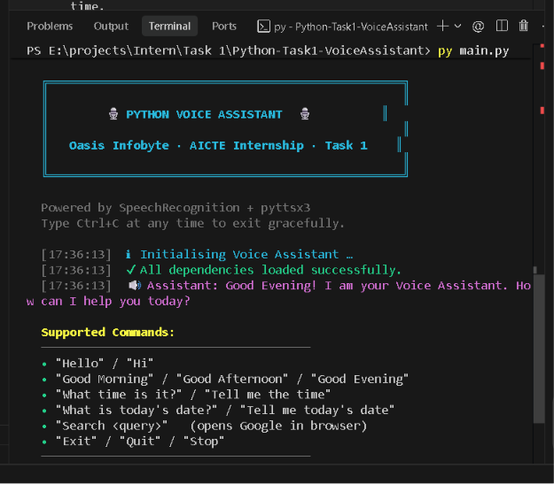
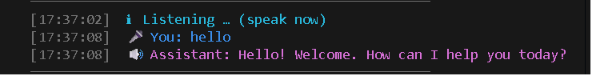
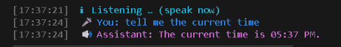
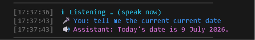
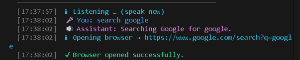
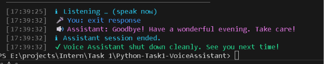

<h1 align="center">🎙️ Python Voice Assistant</h1>

<p align="center">
  <b>Oasis Infobyte · AICTE Internship · Task 1 (Beginner Tier)</b>
</p>

<p align="center">
  
  
  
  
</p>

---

## 📖 Description

A **console-based voice assistant** built entirely in Python. It listens to voice commands through the microphone, processes them using the Google Web Speech API (free), and responds with spoken audio via `pyttsx3` — all without any paid APIs, GUIs, or external services.

This project was developed as part of the **Oasis Infobyte AICTE Internship (Python Programming Track — Task 1, Beginner Tier)**.

---

## ✨ Features

| # | Feature | Example Command |
|---|---------|-----------------|
| 1 | **Greetings** | "Hello", "Hi", "Good Morning", "Good Afternoon", "Good Evening" |
| 2 | **Current Time** | "What time is it?", "Tell me the time" |
| 3 | **Current Date** | "What is today's date?", "Tell me today's date" |
| 4 | **Google Search** | "Search Python programming", "Search Machine Learning" |
| 5 | **Exit / Quit** | "Exit", "Quit", "Stop", "Goodbye" |

### Extra Professional Features

- 🕐 **Time-based greeting** — automatically says Good Morning / Afternoon / Evening
- 🔁 **Continuous listening loop** — keeps listening until you say "exit"
- 🎨 **Colourful console output** — ANSI-styled, timestamped logs
- 🛡️ **Robust error handling** — microphone, internet, timeout, unknown commands
- 🔊 **Every response is spoken** — nothing is text-only
- 📦 **Modular architecture** — clean separation of concerns across five modules
- 📝 **PEP 8 compliant** — docstrings, type hints, and clean formatting

---

## 🛠️ Technologies Used

| Technology | Purpose |
|------------|---------|
| **Python 3.11+** | Core programming language |
| **SpeechRecognition** | Capture and transcribe voice input |
| **PyAudio** | Microphone audio stream access |
| **pyttsx3** | Offline text-to-speech engine |
| **datetime** | Current time and date |
| **webbrowser** | Open Google search in default browser |
| **os** | OS-level utilities |

---

## 📦 Installation

### Prerequisites

- **Python 3.11** or newer — [Download](https://www.python.org/downloads/)
- **pip** (comes with Python)
- **A working microphone**
- **Internet connection** (required for Google Speech Recognition)

### Steps

```bash
# 1. Clone the repository
git clone https://github.com/lohiths14-tech/OIBSIP.git
cd OIBSIP/Python-Task1-VoiceAssistant

# 2. (Recommended) Create a virtual environment
python -m venv venv
venv\Scripts\activate        # Windows

# 3. Install dependencies
pip install -r requirements.txt
```

> **Note (Windows):** If `PyAudio` fails to install, download the correct `.whl` file from  
> [Unofficial Windows Binaries](https://www.lfd.uci.edu/~gohlke/pythonlibs/#pyaudio)  
> and install it with `pip install <filename>.whl`.

---

## 📚 Required Libraries

```
SpeechRecognition==3.14.1
PyAudio==0.2.14
pyttsx3==2.98
```

Install all at once:

```bash
pip install -r requirements.txt
```

---

## ▶️ How To Run

```bash
python main.py
```

The assistant will:

1. Display a startup banner.
2. Greet you based on the current time of day.
3. Show the list of supported commands.
4. Start listening for your voice input.

Press **Ctrl + C** at any time to exit gracefully.

---

## 📂 Folder Structure

```
Python-Task1-VoiceAssistant/
│
├── main.py              # Entry point — starts the assistant
├── assistant.py         # Core listen → route → respond loop
├── commands.py          # Individual command handlers
├── speech.py            # TTS (pyttsx3) and STT (SpeechRecognition)
├── utils.py             # Colours, logging, banner, helpers
│
├── requirements.txt     # Python dependencies
├── README.md            # Project documentation (this file)
├── LICENSE              # MIT License
├── .gitignore           # Git ignore rules
│
└── screenshots/         # Console screenshots for documentation
    └── README.md        # Instructions for adding screenshots
```

---

## 🗣️ Sample Commands

```
You:        "Hello"
Assistant:  "Hello! Welcome. How can I help you today?"

You:        "What time is it?"
Assistant:  "The current time is 10:35 PM."

You:        "What is today's date?"
Assistant:  "Today's date is 9 July 2026."

You:        "Search Python programming"
Assistant:  "Searching Google for Python programming."
            (opens default browser with Google results)

You:        "Exit"
Assistant:  "Goodbye! Have a wonderful evening. Take care!"
```

---

## 📸 Screenshots

> Add screenshots to the `screenshots/` folder and reference them here.

<!-- Example (uncomment after adding images):






-->

---

## 🚀 Future Improvements

- 🌐 Add **weather updates** using a free API (OpenWeatherMap).
- 📰 Add **news headlines** via a free news API.
- 📧 Add **email sending** capability.
- 🧠 Integrate a **local LLM** for general Q&A (no paid APIs).
- 🖥️ Build a **GUI** using Tkinter or PyQt.
- 🗓️ Add **calendar events and reminders**.
- 🎵 Add **music playback** control.
- 📋 Add **note-taking** with local file storage.

---

## 📄 License

This project is licensed under the **MIT License** — see the [LICENSE](LICENSE) file for details.

---

## 👤 Author

**Lohith S**

Python Programming Intern

Oasis Infobyte AICTE Internship

---

<p align="center">
  ⭐ If you found this project helpful, please give it a star!
</p>
